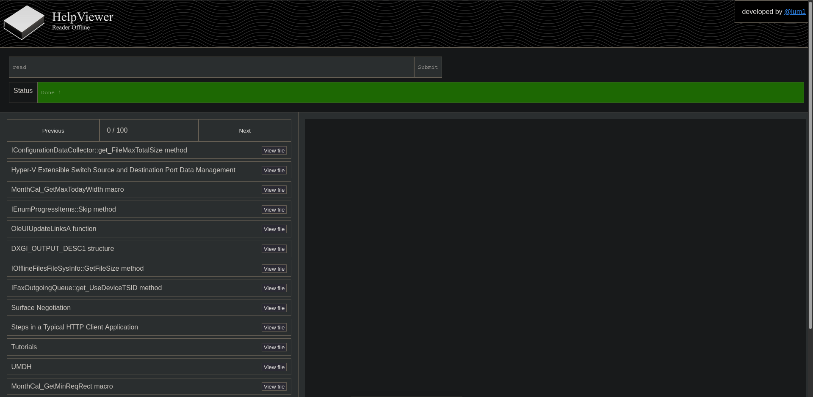

# HelpViewer Offline Reader
> [!Important]
> Under the GNU General Public License version 3 (GPL-3.0), the software is provided "as is," without any warranty or guarantee of any kind. The authors or copyright holders are not liable for any damages or issues that arise from using, modifying, or distributing the software. Use the software at your own risk.

## Frontend

### Features
- Search function
- Results list
- Article renderer

## Installation
1. Install NodeJS (https://nodejs.org/en/download)
2. Create directory at project root called ``helpviewer_data``
3. Download the documentation files
  - Browse and download: https://services.mtps.microsoft.com/serviceapi/products
  - You should find a ``*.cab`` file which is a ``Microsoft Cabinet Archive file``, this can be extracted using [de-]compression tools such as *7zip*.
  - Thereafter you should be able to have a ``*.mshc`` and ``*.mshi``
  - Extract the ``*.mshc`` file, which should give you a bunch of ``.htm`` and other types of files.
  - Move these files into the ``helpviewer_data`` directory __without sub-directory structures__.
4. Install dependencies using ``npm install``
5. Run the nodejs using ``npm start``
6. Use web browser to access the GUI: http://localhost:8080

### Alternative (automated script solution)
Shit is not ready yet, stop asking if u are, idk nobody cares abt this pathetic piss-project cuz everyone is too retarded using windows and visual community like sane people. (hi future employer)

You're good to go!
I expect praises and kisses!
I expect you to bow down before my footsies and kiss them.

# Known issues
- Nvm it borken

### Copyright
SPDX-License-Identifier: GPL-3.0 WITH bison-exception
Copyright © 2026 lum1
